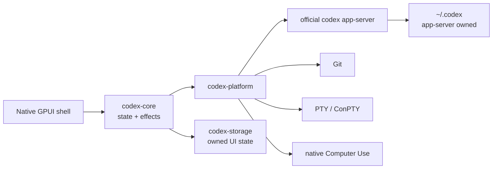

<p align="center">
  
</p>

<h1 align="center">codexRS</h1>

<p align="center">
  The Codex Desktop workflow, rebuilt as a native Rust application for Windows and Linux.<br>
  Official app-server compatibility without Electron, WebView, Node.js, or a bundled browser runtime.
</p>

<p align="center">
  <a href="README.md">English</a> ·
  <a href="README.ru.md">Русский</a> ·
  <a href="README.zh-CN.md">简体中文</a>
</p>

<p align="center">
  <a href="https://github.com/payswapdotorg/Flauz.app/actions/workflows/ci.yml"></a>
  <a href="https://github.com/payswapdotorg/Flauz.app/releases"></a>
  <a href="LICENSE"></a>
  <a href="https://github.com/payswapdotorg/Flauz.app/stargazers"></a>
  <a href="https://github.com/payswapdotorg/Flauz.app/graphs/contributors"></a>
  
</p>

<p align="center">
  <a href="https://github.com/payswapdotorg/Flauz.app/releases/download/v0.1.0-rc.13/codexrs-v0.1.0-rc.13-windows-x86_64.zip"></a>
  <a href="https://github.com/payswapdotorg/Flauz.app/releases/download/v0.1.0-rc.13/codexrs-v0.1.0-rc.13-linux-x86_64.tar.gz"></a>
  <a href="https://github.com/payswapdotorg/Flauz.app/releases/download/v0.1.0-rc.13/SHA256SUMS.txt"></a>
</p>

<p align="center">
  <sub>v0.1.0-rc.13 · unsigned portable preview · official Codex CLI required</sub>
</p>

> [!WARNING]
> codexRS is a release candidate, not a stable build. Windows is smoke-tested
> from the packaged archive. Linux is built and started in Ubuntu CI, but still
> needs broader desktop-environment coverage. Read the
> [current limitations](docs/known-failures.md#active-release-candidate-limitations)
> before enabling Computer Use.

## Why codexRS

codexRS keeps the familiar Codex coding loop while replacing the desktop shell
with a native Rust and GPUI application. It points at `~/.codex` by default,
but only the supervised official `codex app-server` touches live Codex auth,
history, SQLite, JSONL, or logs.

- **Native desktop shell.** No Electron, Tauri, Wry, WebView, Node.js, or
  embedded browser runtime in the client.
- **One Codex source of truth.** Accounts, tasks, models, approvals, plugins,
  and history stay behind the official app-server protocol.
- **Desktop coding workflow.** Tasks, streaming output, Git, branches,
  worktrees, staged and unstaged diffs, pull requests, terminal, files, Browser,
  Computer Use, Apps, plugins, and Marketplace live in one UI.
- **Windows and Linux.** The same Rust workspace builds natively on both
  platforms. Platform-specific process work stays behind `codex-platform`.
- **Inspectable boundaries.** Frames, queues, pages, diffs, captures, logs, and
  subprocess output all have explicit limits.

The behavior reference is Codex Desktop `26.721.3996.0`, which bundled Codex
CLI [`0.146.0-alpha.3.1`](https://github.com/openai/codex/releases/tag/rust-v0.146.0-alpha.3.1).
The reference is not redistributed or used as a runtime dependency.

## What works today

| Area | Current release-candidate slice |
| --- | --- |
| Tasks and composer | New/resumed tasks, streaming timeline, fork, steer, stop, approvals, Plan, Goal, attachments, commands, search, and background completion notifications |
| Repository | Branches, safe sibling worktrees, commits, staged/unstaged scopes, virtualized unified/split diffs, review, and guarded GitHub pull-request flows |
| Terminal and files | Native PTY/ConPTY, bounded scrollback, workspace-confined file previews, outputs, and clickable assistant file citations |
| Browser | Isolated native browser control surface, task-scoped tabs, permission policy, downloads, uploads, and agent actions |
| Computer Use | Windows native discovery, screenshots, accessibility, input, interruption, overlay, app launch, and per-app approval; Linux currently has screenshot-only X11/XWayland observation |
| Extensibility | Skills, plugins, MCP Apps, desktop-app mentions, and Marketplace add/remove/upgrade/install flows through app-server methods |
| Settings and storage | Catalog-backed account/model/runtime settings plus a small single-writer codexRS database for UI preferences and local-project metadata |

See the [parity matrix](docs/parity-matrix.md) for exact completed and partial
contracts. The largest remaining gaps are full Linux Computer Use, scheduled
tasks, signed installers and updates, complete keyboard/screen-reader coverage,
per-hunk diff actions, and final visual parity.

## Native efficiency, without made-up benchmarks

| Design choice | Practical effect |
| --- | --- |
| No bundled Chromium or Node runtime | The client does not ship or keep a second browser application stack alive just to render its UI |
| Paginated app-server history | Startup does not scan gigabytes of live JSONL history or materialize whole task timelines |
| Virtualized diffs and timelines | Only the visible slice is laid out; large reviews do not require every row to remain rendered |
| Bounded channels and byte budgets | Bursts apply backpressure or recover from the source of truth instead of growing queues indefinitely |
| Fixed terminal scrollback and capped captures | Long terminals and Computer Use sessions cannot grow retained output without a limit |
| Thin LTO and stripped release symbols | Portable preview archives stay compact; recent builds are roughly 15 MiB for Windows ZIP and 18 MiB for Linux tar.gz |

Archive size is not RAM usage. A controlled, like-for-like memory benchmark
against Codex Desktop is not published yet, so this project does not claim an
invented percentage saving. The concrete optimization today is removing the
embedded web runtime and bounding every growth path. Exact limits are listed in
[known failures and budgets](docs/known-failures.md).

## Failure modes already removed

| Observed failure | codexRS behavior |
| --- | --- |
| Windows multi-root path handling could reach a white screen | Native `Path`/`PathBuf` handling keeps Windows drive paths out of browser shims |
| A single JSONL line reached 594,127,437 bytes | Live history is never read directly; bounded app-server pages own history access |
| Startup history reached about 9 GB | `thread/list` is paginated and always requests state-database-only metadata |
| Filesystem notifications caused repeated `git.exe` spawning | Refreshes are debounced and coalesced with one backend Git operation at a time |
| Cleanup produced `taskkill`, `conhost`, and WMI storms | Supervised process trees use graceful shutdown and one bounded fallback |
| Late async replies overwrote newer UI state | Workspace, task, Browser, Marketplace, diff, settings, and fork results are generation-scoped |

These are regression inputs, not behavior copied from the reference. The full
evidence list lives in [docs/known-failures.md](docs/known-failures.md).

## Architecture



All protocol frames, queues, history pages, diffs, terminal output, screenshots,
and subprocess diagnostics have explicit limits. See
[Architecture](docs/architecture.md), [Parity matrix](docs/parity-matrix.md), and
[Platform support](docs/platform-support.md) for the full boundaries and
current gap inventory.

## Quick start

### 1. Install the official Codex CLI

Follow the current [Codex CLI setup guide](https://learn.chatgpt.com/docs/codex/cli),
then run `codex` once to sign in. codexRS supervises the CLI's native
`app-server`; it does not embed the CLI or require a Node runtime of its own.

Verify that the executable is available:

```text
codex --version
```

If it is not on `PATH`, set `CODEX_RS_CODEX_BIN` to the native `codex` or
`codex.exe` executable.

### 2. Download the portable preview

Current preview: **v0.1.0-rc.13**.

- [Windows x86_64 ZIP](https://github.com/payswapdotorg/Flauz.app/releases/download/v0.1.0-rc.13/codexrs-v0.1.0-rc.13-windows-x86_64.zip)
- [Linux x86_64 tar.gz](https://github.com/payswapdotorg/Flauz.app/releases/download/v0.1.0-rc.13/codexrs-v0.1.0-rc.13-linux-x86_64.tar.gz)
- [SHA-256 checksums](https://github.com/payswapdotorg/Flauz.app/releases/download/v0.1.0-rc.13/SHA256SUMS.txt)
- [All releases and release notes](https://github.com/payswapdotorg/Flauz.app/releases)

Verify the archive before extraction. On Linux, run
`grep 'codexrs-v0.1.0-rc.13-linux-x86_64.tar.gz$' SHA256SUMS.txt | sha256sum -c -`.
On Windows, compare
`(Get-FileHash .\codexrs-v0.1.0-rc.13-windows-x86_64.zip -Algorithm SHA256).Hash`
with the matching entry. The checksum detects transfer corruption; it is not an
independent publisher signature.

These are unsigned portable technical-preview archives. They do not
automatically install a Start Menu entry, desktop entry, URI handler,
uninstaller, or updater. Extract them into a
directory you control. On Windows, keep `codexrs.exe` and
`codex-computer-use-overlay.exe` together. To update, quit codexRS and replace
the extracted directory; to remove it, delete only that directory. Neither
operation removes your `CODEX_HOME` or codexRS-owned state. Do not enable
Computer Use from an archive whose source or checksum you do not trust.

The Linux archive is not a system package: it does not install runtime
dependencies or desktop integration automatically. Run
`codexrs --install-desktop-entry` to create a per-user desktop entry for the
current extracted binary. If Codex CLI is outside the desktop session's
`PATH`, run the installer with an absolute `CODEX_RS_CODEX_BIN`; the entry
captures that path. The command never changes an existing entry, so remove and
recreate it after either binary moves. Ubuntu
CI starts the extracted archive in an isolated Xvfb session; broader
desktop-environment smoke coverage remains pending. Linux Computer Use
provides only bounded, read-only screenshot observation of X11/XWayland windows
when `DISPLAY` is nonempty. Text extraction, input, app launch, persistent
approvals, the overlay, and interruption monitoring are unavailable; pure
Wayland without XWayland is unsupported.

### 3. Build codexRS

Install Git, Rust through `rustup`, and the native packages listed under
[Platform support](docs/platform-support.md), then:

```text
git clone https://github.com/payswapdotorg/Flauz.app.git
cd codexRS
cargo build --release -p codex-app
```

Run on Windows:

```powershell
.\target\release\codexrs.exe
```

Run on Linux:

```bash
./target/release/codexrs
```

Linux build packages and desktop-session limitations are listed in
[Platform support](docs/platform-support.md).

### Development isolation

Normal use defaults to `~/.codex`. For protocol development and tests, point
`CODEX_HOME` at an isolated directory:

```powershell
$env:CODEX_HOME = 'E:\scratch\isolated-codex-home'
cargo build -p codex-app --bins
cargo run -p codex-app --bin codexrs
```

codexRS-owned state can be redirected independently with
`CODEX_RS_DATA_DIR`.

## Contributing

Contributions are welcome. Start with
[Contributing](CONTRIBUTING.md), read [AGENTS.md](AGENTS.md), and keep changes
focused on an observable requirement or failure. Large features should begin
as an issue or discussion so the contract is clear before implementation.

- [Good first issues](https://github.com/payswapdotorg/Flauz.app/labels/good%20first%20issue)
- [Help wanted](https://github.com/payswapdotorg/Flauz.app/labels/help%20wanted)
- [Discussions](https://github.com/payswapdotorg/Flauz.app/discussions)
- [Roadmap](ROADMAP.md)
- [Codex Desktop parity matrix](docs/parity-matrix.md)
- [Support](SUPPORT.md)
- [Security policy](SECURITY.md)
- [Code of Conduct](CODE_OF_CONDUCT.md)
- [Prior-art review](docs/prior-art.md)

If codexRS solves a real problem for you, a GitHub star helps more contributors
find the project.

## Contributors

<a href="https://github.com/payswapdotorg/Flauz.app/graphs/contributors">
  
</a>

## Star history

[](https://www.star-history.com/?repos=Kiwunaka%2FcodexRS&type=date&legend=top-left)

## License and upstream notice

codexRS is licensed under [Apache License 2.0](LICENSE).

This is an independent community project. It is not affiliated with or endorsed
by OpenAI. Codex and OpenAI names belong to their respective owners. The
official Codex CLI is installed and licensed separately.
