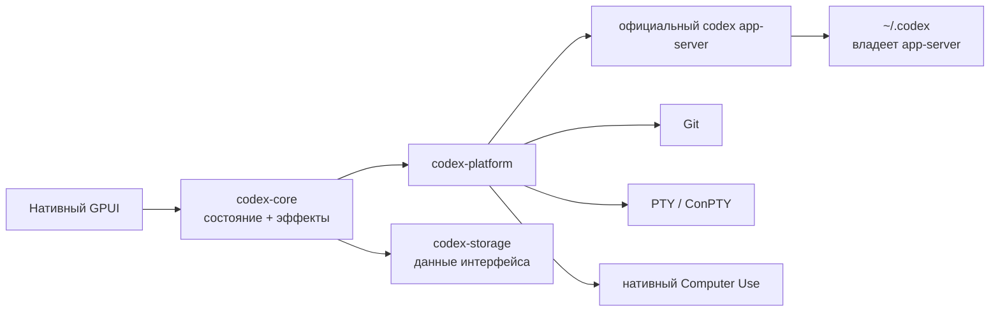

<p align="center">
  
</p>

<h1 align="center">codexRS</h1>

<p align="center">
  Рабочий процесс Codex Desktop, пересобранный как нативное Rust-приложение для Windows и Linux.<br>
  Официальный app-server без Electron, WebView, Node.js и встроенного браузерного runtime.
</p>

<p align="center">
  <a href="README.md">English</a> ·
  <a href="README.ru.md">Русский</a> ·
  <a href="README.zh-CN.md">简体中文</a>
</p>

<p align="center">
  <a href="https://github.com/payswapdotorg/Flauz.app/actions/workflows/ci.yml"></a>
  <a href="https://github.com/payswapdotorg/Flauz.app/releases"></a>
  <a href="LICENSE"></a>
  <a href="https://github.com/payswapdotorg/Flauz.app/stargazers"></a>
  <a href="https://github.com/payswapdotorg/Flauz.app/graphs/contributors"></a>
  
</p>

<p align="center">
  <a href="https://github.com/payswapdotorg/Flauz.app/releases/download/v0.1.0-rc.13/codexrs-v0.1.0-rc.13-windows-x86_64.zip"></a>
  <a href="https://github.com/payswapdotorg/Flauz.app/releases/download/v0.1.0-rc.13/codexrs-v0.1.0-rc.13-linux-x86_64.tar.gz"></a>
  <a href="https://github.com/payswapdotorg/Flauz.app/releases/download/v0.1.0-rc.13/SHA256SUMS.txt"></a>
</p>

<p align="center">
  <sub>v0.1.0-rc.13 · неподписанный portable preview · нужна официальная Codex CLI</sub>
</p>

> [!WARNING]
> codexRS пока release candidate, а не стабильный релиз. Windows-сборка
> запускается из готового архива прямо в CI. Linux собирается и стартует в
> Ubuntu CI, но его ещё нужно прогнать на большем числе desktop-окружений.
> Перед включением Computer Use прочитайте
> [текущие ограничения](docs/known-failures.md#active-release-candidate-limitations).

## Зачем нужен codexRS

codexRS сохраняет привычный рабочий процесс Codex, но заменяет desktop-оболочку
на нативное приложение на Rust и GPUI. По умолчанию оно направлено прямо на
`~/.codex`, однако живые auth, история, SQLite, JSONL и логи остаются за
официальным `codex app-server`. Сам клиент их напрямую не открывает.

- **Нативный интерфейс.** Внутри нет Electron, Tauri, Wry, WebView, Node.js и
  встроенного браузерного runtime.
- **Один источник данных.** Аккаунт, задачи, модели, approvals, плагины и
  история идут через официальный app-server.
- **Весь рабочий цикл в одном окне.** Чаты, потоковые ответы, Git, ветки,
  worktree, staged/unstaged diff, pull request, терминал, файлы, Browser,
  Computer Use, Apps, плагины и Marketplace.
- **Windows и Linux.** Один Rust-workspace собирается нативно на обеих
  платформах, а платформенный код изолирован в `codex-platform`.
- **Предсказуемые границы.** У фреймов, очередей, страниц истории, диффов,
  скриншотов, логов и вывода процессов есть жёсткие лимиты.

Эталон поведения: Codex Desktop `26.721.3996.0` со встроенной Codex CLI
[`0.146.0-alpha.3.1`](https://github.com/openai/codex/releases/tag/rust-v0.146.0-alpha.3.1).
Эталонный бинарник не входит в репозиторий, сборки и runtime codexRS.

## Что работает сейчас

| Область | Что есть в текущем RC |
| --- | --- |
| Задачи и composer | Новые и возобновлённые задачи, потоковая лента, fork, steer, stop, approvals, Plan, Goal, вложения, команды, поиск и уведомления о фоновых завершениях |
| Репозиторий | Ветки, безопасные соседние worktree, коммиты, staged/unstaged, виртуализированный unified/split diff, review и защищённые сценарии GitHub pull request |
| Терминал и файлы | Нативный PTY/ConPTY, ограниченный scrollback, безопасный preview файлов и outputs, кликабельные ссылки на файлы из ответов |
| Browser | Изолированное управление браузером, вкладки в контексте задачи, разрешения, скачивания, загрузки и agent-действия |
| Computer Use | Windows: поиск окон, скриншоты, accessibility, ввод, Esc-прерывание, системный overlay, запуск приложений и разрешения; Linux: пока только скриншоты X11/XWayland |
| Расширения | Skills, плагины, MCP Apps, упоминания desktop-приложений и Marketplace с add/remove/upgrade/install через app-server |
| Настройки и хранение | Настройки аккаунта, моделей и runtime плюс маленькая single-writer база codexRS только для UI и списка локальных проектов |

Точный статус каждого контракта есть в [матрице паритета](docs/parity-matrix.md).
Самые крупные оставшиеся куски: полноценный Linux Computer Use, scheduled
tasks, подписанные установщики и обновления, полный keyboard/screen-reader pass,
действия с отдельными hunk в diff и финальный визуальный паритет.

## Экономия ресурсов без выдуманных процентов

| Решение | Что это даёт |
| --- | --- |
| Нет встроенных Chromium и Node.js | Клиент не поставляет и не держит второй браузерный стек только ради отрисовки интерфейса |
| История читается страницами через app-server | При старте не сканируются гигабайты живых JSONL и не загружается целиком вся история |
| Виртуализированные diff и timeline | Большой review не заставляет интерфейс постоянно держать отрисованными все строки |
| Ограниченные очереди и byte budget | Всплеск событий создаёт backpressure или resync, а не бесконечно растущую очередь |
| Фиксированный scrollback и лимиты скриншотов | Долгий терминал и Computer Use не накапливают данные без верхней границы |
| Thin LTO и удаление debug symbols | Portable-сборки остаются компактными: последние архивы занимают примерно 15 МиБ для Windows и 18 МиБ для Linux |

Размер архива не равен расходу RAM. Честного одинакового memory-бенчмарка
codexRS против Codex Desktop пока нет, поэтому мы не рисуем «на 70% меньше
памяти» из воздуха. Реальная оптимизация сейчас - отсутствие встроенного web
runtime и явный предел у каждого пути роста. Все числа собраны в
[списке лимитов](docs/known-failures.md#current-budgets).

## Какие проблемы уже закрыты

| Наблюдавшаяся проблема | Как ведёт себя codexRS |
| --- | --- |
| Multi-root пути на Windows могли приводить к белому экрану | Нативные `Path`/`PathBuf` не прогоняют пути дисков через браузерные shim |
| Одна строка JSONL достигала 594 127 437 байт | Живая история напрямую не читается, доступ идёт ограниченными страницами app-server |
| История при старте доходила примерно до 9 ГБ | `thread/list` работает постранично и запрашивает только метаданные state database |
| Уведомления файловой системы порождали поток `git.exe` | Обновления объединяются с debounce, одновременно идёт одна backend Git-операция |
| Cleanup создавал шторм `taskkill`, `conhost` и WMI | Дерево процессов завершается под надзором: сначала мягко, затем один ограниченный fallback |
| Поздний async-ответ перетирал более новое состояние UI | Результаты workspace, task, Browser, Marketplace, diff, settings и fork привязаны к поколению запроса |

Это regression-входы, а не поведение, которое копируется из эталона. Полный
список и доказательства лежат в [docs/known-failures.md](docs/known-failures.md).

## Архитектура



У фреймов протокола, очередей, страниц истории, диффов, вывода терминала,
скриншотов и диагностики процессов есть жёсткие границы. Подробности:
[архитектура](docs/architecture.md), [матрица паритета](docs/parity-matrix.md) и
[поддержка платформ](docs/platform-support.md).

## Быстрый старт

### 1. Установите официальную Codex CLI

Следуйте актуальной [инструкции Codex CLI](https://learn.chatgpt.com/docs/codex/cli),
затем один раз запустите `codex` и войдите в аккаунт. codexRS запускает нативный
`app-server` из официальной CLI. Самому приложению Node.js не нужен.

Проверьте, что команда доступна:

```text
codex --version
```

Если CLI нет в `PATH`, задайте `CODEX_RS_CODEX_BIN` с путём к нативному
`codex` или `codex.exe`.

### 2. Скачайте portable preview

Текущий preview: **v0.1.0-rc.13**.

- [Windows x86_64, ZIP](https://github.com/payswapdotorg/Flauz.app/releases/download/v0.1.0-rc.13/codexrs-v0.1.0-rc.13-windows-x86_64.zip)
- [Linux x86_64, tar.gz](https://github.com/payswapdotorg/Flauz.app/releases/download/v0.1.0-rc.13/codexrs-v0.1.0-rc.13-linux-x86_64.tar.gz)
- [Контрольные суммы SHA-256](https://github.com/payswapdotorg/Flauz.app/releases/download/v0.1.0-rc.13/SHA256SUMS.txt)
- [Все релизы и release notes](https://github.com/payswapdotorg/Flauz.app/releases)

Проверьте архив до распаковки. В Linux выполните
`grep 'codexrs-v0.1.0-rc.13-linux-x86_64.tar.gz$' SHA256SUMS.txt | sha256sum -c -`.
В Windows сравните
`(Get-FileHash .\codexrs-v0.1.0-rc.13-windows-x86_64.zip -Algorithm SHA256).Hash`
с нужной строкой. Checksum помогает найти повреждение при передаче, но не
является независимой подписью издателя.

Это неподписанные portable-архивы технического preview. Они не устанавливают
ярлык в Start Menu, URI handler, деинсталлятор или updater. Распакуйте их в
каталог под вашим контролем. В Windows `codexrs.exe` и
`codex-computer-use-overlay.exe` должны оставаться рядом. Для обновления
закройте codexRS и замените распакованный каталог; для удаления удалите только
этот каталог. Обе операции не удаляют `CODEX_HOME` и данные codexRS. Не
включайте Computer Use из архива, источнику или checksum которого не доверяете.

Linux-архив не является системным пакетом: он не ставит runtime-зависимости и
не выполняет desktop integration автоматически. Команда
`codexrs --install-desktop-entry` создаёт пользовательский desktop entry для
текущего распакованного бинарника. Если Codex CLI отсутствует в `PATH`
desktop-сессии, запустите installer с абсолютным `CODEX_RS_CODEX_BIN`: entry
сохранит этот путь. Команда никогда не меняет существующий entry, поэтому после
переноса любого бинарника удалите entry и создайте его заново.
Ubuntu CI запускает распакованный архив в изолированной Xvfb-сессии; более широкое
smoke-тестирование desktop-окружений ещё продолжается. Linux Computer Use даёт только
ограниченное read-only наблюдение со скриншотами окон X11/XWayland при
непустом `DISPLAY`. Извлечение текста, ввод, запуск приложений, постоянные
разрешения, overlay и мониторинг прерываний недоступны; pure Wayland без
XWayland не поддерживается.

### 3. Соберите codexRS

Установите Git, Rust через `rustup` и нативные пакеты из раздела
[поддержки платформ](docs/platform-support.md), затем:

```text
git clone https://github.com/payswapdotorg/Flauz.app.git
cd codexRS
cargo build --release -p codex-app
```

Запуск на Windows:

```powershell
.\target\release\codexrs.exe
```

Запуск на Linux:

```bash
./target/release/codexrs
```

Пакеты для сборки под Linux и ограничения desktop-сессий перечислены в
[документе о платформах](docs/platform-support.md).

### Изолированная разработка

При обычном запуске используется `~/.codex`. Для разработки протокола и тестов
направьте `CODEX_HOME` в отдельную папку:

```powershell
$env:CODEX_HOME = 'E:\scratch\isolated-codex-home'
cargo build -p codex-app --bins
cargo run -p codex-app --bin codexrs
```

Собственные данные codexRS можно отдельно перенести через
`CODEX_RS_DATA_DIR`.

## Как помочь проекту

Контрибьюты открыты. Сначала прочитайте
[CONTRIBUTING.md](CONTRIBUTING.md) и [AGENTS.md](AGENTS.md). Изменение должно
решать понятную задачу или подтверждённую ошибку. Большие функции лучше сначала
обсудить в issue или Discussions, чтобы до кода согласовать контракт.

- [Задачи для первого контрибьюта](https://github.com/payswapdotorg/Flauz.app/labels/good%20first%20issue)
- [Нужна помощь](https://github.com/payswapdotorg/Flauz.app/labels/help%20wanted)
- [Обсуждения](https://github.com/payswapdotorg/Flauz.app/discussions)
- [План развития](ROADMAP.md)
- [Матрица паритета с Codex Desktop](docs/parity-matrix.md)
- [Поддержка](SUPPORT.md)
- [Безопасность](SECURITY.md)
- [Кодекс поведения](CODE_OF_CONDUCT.md)
- [Разбор похожих проектов](docs/prior-art.md)

Если codexRS решает вашу боль, поставьте звезду. Так проект увидит больше людей,
которые могут помочь с кодом и тестированием.

## Контрибьюторы

<a href="https://github.com/payswapdotorg/Flauz.app/graphs/contributors">
  
</a>

## Рост проекта

[](https://www.star-history.com/?repos=Kiwunaka%2FcodexRS&type=date&legend=top-left)

## Лицензия и связь с upstream

codexRS распространяется по [Apache License 2.0](LICENSE).

Это независимый проект сообщества, не связанный с OpenAI и не одобренный ею.
Названия Codex и OpenAI принадлежат их владельцам. Официальная Codex CLI
устанавливается и лицензируется отдельно.
