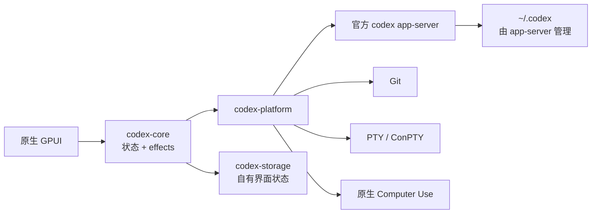

<p align="center">
  
</p>

<h1 align="center">codexRS</h1>

<p align="center">
  以完整功能和 UX 对等为目标的 Codex Desktop 原生 Rust 替代方案。<br>
  无需 Electron、WebView 或浏览器运行时即可兼容官方 app-server。
</p>

<p align="center">
  <a href="README.md">English</a> ·
  <a href="README.ru.md">Русский</a> ·
  <a href="README.zh-CN.md">简体中文</a>
</p>

<p align="center">
  <a href="https://github.com/payswapdotorg/Flauz.app/actions/workflows/ci.yml"></a>
  <a href="https://github.com/payswapdotorg/Flauz.app/releases"></a>
  <a href="LICENSE"></a>
  <a href="https://github.com/payswapdotorg/Flauz.app/stargazers"></a>
  <a href="https://github.com/payswapdotorg/Flauz.app/graphs/contributors"></a>
  
</p>

<p align="center">
  <a href="https://github.com/payswapdotorg/Flauz.app/releases/download/v0.1.0-rc.13/codexrs-v0.1.0-rc.13-windows-x86_64.zip"></a>
  <a href="https://github.com/payswapdotorg/Flauz.app/releases/download/v0.1.0-rc.13/codexrs-v0.1.0-rc.13-linux-x86_64.tar.gz"></a>
  <a href="https://github.com/payswapdotorg/Flauz.app/releases/download/v0.1.0-rc.13/SHA256SUMS.txt"></a>
</p>

<p align="center">
  <sub>v0.1.0-rc.13 · 未签名便携预览版 · 需要官方 Codex CLI</sub>
</p>

> [!IMPORTANT]
> 当前代码树面向预览版。Windows 已通过针对精确 stable
> 参考版本的源码端到端冒烟测试。Linux 已纳入原生 CI，但在稳定版发布前仍需覆盖更多桌面环境。

## 为什么选择 codexRS

codexRS 提供一个体积更小、边界更清晰的 Codex 原生客户端：

- 使用 Rust 与 GPUI 构建原生界面；
- 不包含 Electron、Tauri、Wry、WebView、Node.js 或嵌入式浏览器；
- 官方 `codex app-server` 始终是数据源；
- 默认直接使用 `~/.codex`；
- codexRS 本身不会直接打开实时 Codex auth、SQLite、JSONL 或日志文件。

行为参考版本为 Codex Desktop `26.721.3996.0`，其中包含 Codex CLI
[`0.146.0-alpha.3.1`](https://github.com/openai/codex/releases/tag/rust-v0.146.0-alpha.3.1)。
该上游二进制文件仅用于兼容性验证，不会随本项目分发。

## 已实现功能

| 领域 | 当前能力 |
| --- | --- |
| 任务 | 有界分页、恢复、fork、输入框、流式时间线与审批 |
| 仓库 | 状态、暂存/未暂存文件、大型虚拟化差异、分支切换与安全的同级 worktree |
| 终端 | 原生 PTY/ConPTY 与有界 VT 输出 |
| Computer Use | Windows：原生窗口发现与控制，按应用审批、按任务授权，并由 app-server 管理始终允许列表；Linux：当 `DISPLAY` 非空时，对 X11/XWayland 窗口提供有界只读截图观察 |
| 插件 | 原生目录标签、有界图片加载、已安装插件与来源管理、创建入口，以及通过 app-server 添加/移除/升级 marketplace、安装和卸载 |
| 持久化 | 独立单写者 SQLite，保存 codexRS 界面偏好以及带名称和置顶状态的有界本地项目注册表 |
| 平台 | Windows 已完成源码冒烟测试；Ubuntu CI 构建并测试 UI、app-server、Git 与 PTY；当 `DISPLAY` 非空时，Linux Computer Use 提供 X11/XWayland 截图观察 |

Computer Use 必须按任务启用。Windows 提供下文所述的完整发现与控制能力。Linux 仅在 `DISPLAY` 非空时，对 X11/XWayland 窗口提供有界只读截图观察；不支持文本提取、输入、应用启动、持久化审批、覆盖层或中断监控，且不支持没有 XWayland 的纯 Wayland。Windows 上的每个读取或控制动作都携带由有界 discovery 返回的精确 `Window { app, id, title? }`；codexRS 会重新解析不透明窗口 ID，并在执行前验证当前所属应用。原生检查器中的窗口选择仅用于手动操作。每个真实应用首次被读取或控制前都会单独请求授权。在 Windows 上，packaged 应用保留大小写不变的 AUMID；普通 executable 优先采用与 stable 相同的 known-folder GUID 标识，否则采用大小写不变的绝对路径，旧的 `process:` 标识仍可用于匹配。已知共享宿主进程和过长标识会直接拒绝。`Allow once` 仅覆盖当前任务，`Always allow` 通过官方 app-server 持久化，但两者都不能绕过针对 Codex、终端、密码管理器、身份与安全界面的 product-policy 禁止规则。原生 Windows 应用目录会有界读取两套 Start Menu、execution aliases、AppsFolder 与已安装包 manifests，并通过 Shell AppUserModel ID、link target path 和有界 UserAssist process key 提供 stable 形状的应用与使用记录；模型直接启动应用时沿用同一套按应用审批。截图只保留在内存中，并在进入协议前受到尺寸限制；短期 screenshot ID 会把缩放图像坐标映射回真实窗口。Windows 的可访问性树、窗口激活与索引操作运行在受监管的原生 Rust helper 中：最多 512 个元素、128 KiB，单次请求超时为 10 秒；第三方 UI Automation provider 卡死时只终止 helper，不会冻结客户端。输入方法会自动激活精确目标窗口，`activate_window` 则保留为与 stable Window2 一致的显式恢复动作。受保护的输入开始前，必须先显示带有 stable 精确文案 `ChatGPT is using your computer` / `Esc to cancel` 的原生置顶系统指示器。它持续到本次 Computer Use 回合结束，不获取焦点、不拦截点击，也不会进入截图；若无法显示，输入动作会被拒绝。Windows 发行包会在 `codexrs.exe` 旁附带 `codex-computer-use-overlay.exe`；该窗口由此受监管的原生进程通过有界 IPC 驱动，并由 kill-on-close Job Object 随客户端一同终止。

## 架构



协议帧、队列、历史分页、差异、终端输出、截图和进程诊断均具有明确上限。详见
[架构说明](docs/architecture.md)、[对等矩阵](docs/parity-matrix.md)与
[平台支持](docs/platform-support.md)。

## 快速开始

### 1. 安装官方 Codex CLI

按照最新的 [Codex CLI 指南](https://learn.chatgpt.com/docs/codex/cli)安装，
然后运行一次 `codex` 完成登录。codexRS 只负责监管 CLI 的原生
`app-server`，自身不依赖 Node.js。

```text
codex --version
```

如果 CLI 不在 `PATH` 中，请将 `CODEX_RS_CODEX_BIN` 设置为原生
`codex` 或 `codex.exe` 的路径。

### 2. 下载便携预览版

仅从 [GitHub Releases](https://github.com/payswapdotorg/Flauz.app/releases)
页面下载。每个预览版都包含 `codexrs-<tag>-windows-x86_64.zip`、
`codexrs-<tag>-linux-x86_64.tar.gz` 和 `SHA256SUMS.txt`；请将 `<tag>`
替换为所选 release 的完整 tag。
解压前请校验 checksum：Linux 可运行
`grep ' \./codexrs-<tag>-linux-x86_64.tar.gz$' SHA256SUMS.txt | sha256sum -c -`；Windows
可将 `(Get-FileHash .\codexrs-<tag>-windows-x86_64.zip -Algorithm SHA256).Hash`
与对应条目比较。checksum 只能在从可信 release 页面取得后发现损坏，不能替代
独立的发布者签名。

这些是未签名的便携技术预览包，不会安装 Start Menu 项、URI handler、卸载程序或
自动更新程序。请解压到由你控制的目录。Windows 上必须将 `codexrs.exe` 与
`codex-computer-use-overlay.exe` 保留在同一目录。更新时先退出 codexRS，再替换
解压目录；删除时只删除该目录。两者都不会删除 `CODEX_HOME` 或 codexRS 自己的
状态数据。不要从来源或 checksum 不可信的归档中启用 Computer Use。

Linux 归档不是系统软件包：它不会自动安装 runtime 依赖或 desktop integration。
运行 `codexrs --install-desktop-entry` 可为当前解压出的二进制文件创建用户级 desktop
entry。如果 Codex CLI 不在桌面会话的 `PATH` 中，请在安装时设置绝对路径
`CODEX_RS_CODEX_BIN`；entry 会保存该路径。该命令绝不修改已有 entry，因此任一二进制
移动后需要删除并重新创建 entry。Ubuntu CI 会在隔离的 Xvfb 会话中启动解压后的归档；
更广泛的桌面环境 smoke 测试仍在进行中。该预览版中 Linux Computer Use 仅在 `DISPLAY` 非空时，对 X11/XWayland 窗口提供有界只读截图
观察。不支持文本提取、输入、应用启动、持久化审批、覆盖层或中断监控；不支持没有
XWayland 的纯 Wayland。

### 3. 构建 codexRS

安装 Git、通过 `rustup` 安装 Rust，并准备[平台支持](docs/platform-support.md)
中列出的原生依赖：

```text
git clone https://github.com/payswapdotorg/Flauz.app.git
cd codexRS
cargo build --release -p codex-app
```

Windows：

```powershell
.\target\release\codexrs.exe
```

Linux：

```bash
./target/release/codexrs
```

Linux 构建依赖与桌面会话限制请参阅[平台支持](docs/platform-support.md)。

### 隔离开发环境

正常使用默认指向 `~/.codex`。协议开发和测试应将 `CODEX_HOME` 指向独立目录：

```powershell
$env:CODEX_HOME = 'E:\scratch\isolated-codex-home'
cargo build -p codex-app --bins
cargo run -p codex-app --bin codexrs
```

可使用 `CODEX_RS_DATA_DIR` 单独重定向 codexRS 自有数据。

## 参与贡献

欢迎贡献。请先阅读 [CONTRIBUTING.md](CONTRIBUTING.md) 与
[AGENTS.md](AGENTS.md)。大型功能应先通过 issue 或 Discussions 明确行为契约。

- [适合首次贡献的任务](https://github.com/payswapdotorg/Flauz.app/labels/good%20first%20issue)
- [需要帮助](https://github.com/payswapdotorg/Flauz.app/labels/help%20wanted)
- [讨论区](https://github.com/payswapdotorg/Flauz.app/discussions)
- [路线图](ROADMAP.md)
- [Codex Desktop 对等矩阵](docs/parity-matrix.md)
- [支持](SUPPORT.md)
- [安全策略](SECURITY.md)
- [行为准则](CODE_OF_CONDUCT.md)
- [同类项目调研](docs/prior-art.md)

## 贡献者

<a href="https://github.com/payswapdotorg/Flauz.app/graphs/contributors">
  
</a>

## Star 趋势

[](https://www.star-history.com/?repos=Kiwunaka%2FcodexRS&type=date&legend=top-left)

## 许可证与上游声明

codexRS 使用 [Apache License 2.0](LICENSE)。

这是一个独立社区项目，与 OpenAI 无隶属或背书关系。Codex 与 OpenAI 名称归其各自所有者。官方 Codex CLI 需单独安装并遵循其许可。
