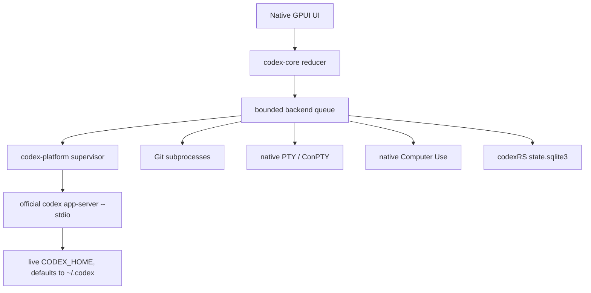

# Architecture

## Compatibility reference

codexRS uses Codex Desktop `26.721.3996.0` and its bundled Codex CLI
`0.146.0-alpha.3.1` as an executable behavioral specification. We reproduce
observable UI flows and the app-server contract. Extracted upstream code,
assets, and binaries are never runtime dependencies or release artifacts.

The runtime dependency is the user's separately installed official `codex`
executable.

## Workspace boundaries

```text
codex-app
├── codex-core       domain state, reducer, actions, and effects
├── codex-protocol   typed bounded app-server wire contract
├── codex-storage    codexRS-owned single-writer SQLite state
└── codex-platform   supervision, Git, PTY, paths, and Computer Use
```

The GPUI thread renders state and dispatches actions. Storage, Git, PTY,
Computer Use, and app-server calls execute behind a bounded backend queue.

## Runtime ownership



The official app-server is the only codexRS runtime component allowed to own or
interpret live Codex authentication, configuration, SQLite, JSONL, and logs.
codexRS does not mirror those writes and does not open those files directly.

Development and tests use an isolated `CODEX_HOME`. Snapshot imports may be
added for recovery or fixtures, but they must never become a second live
writer.

## App-server protocol

The supervisor maintains one long-lived, multiplexed stdio connection:

1. spawn `codex app-server --stdio`;
2. send `initialize` with `experimentalApi: true`;
3. receive the response and send `initialized`;
4. route bounded requests, notifications, approvals, and dynamic tool calls;
5. perform one graceful shutdown, followed by one bounded process-tree
   termination fallback.

Task discovery always uses paginated `thread/list` with
`useStateDbOnly: true`. Timeline items are loaded separately in bounded pages.
The default metadata page is 20 tasks and the maximum is 100.

Protocol limits include:

- 16 MiB per newline-delimited frame;
- 64 pending requests;
- 256 interleaved messages while waiting for a response;
- bounded command, event, and decoded-message channels;
- redacted diagnostics that never echo raw provider payloads.

### Flauz platform evolution contract

The current native implementation is the local desktop implementation of a
larger provider-neutral platform. The following boundaries are frozen for future
work.

### Client adapters

Linux, Windows, macOS, Web, and Mobile are client adapters over the same logical
Workspace/Session model. A desktop client may control either its local
environment or a remote Environment.

### Environment and provider boundary

An Environment is the execution context. A Provider supplies an Environment.
Local PTY/Browser/Computer Use/Git facilities become the
`LocalEnvironmentProvider` implementation; remote providers implement the same
contracts.

Initial provider families are interactive sandboxes, persistent hosts, desktop
hosts, and batch/CI runners. E2B, Daytona, Azure, GitHub Actions, Codemagic,
Vercel Sandbox, Cloudflare Sandbox, and future/custom providers are adapters.

### Model and agent-runtime boundary

A Model supplies intelligence. An AgentRuntime supplies the agent execution
loop. The official Codex app-server is a first-class AgentRuntime; it is not the
universal Flauz model registry.

Flauz owns a provider-neutral Model/ModelProvider registry so Gemini, Anthropic,
GitHub Copilot, OpenAI-compatible endpoints, Ollama, LM Studio, and future
providers can be added without changing Workspace/Session/Skill semantics.

### Capability and skill boundary

Skills declare requirements. Capabilities are resolved from model/runtime,
environment/provider, permissions, and workspace policy. Computer Use is a
compound capability rather than a model-only boolean.

A skill that cannot currently execute must expose an actionable capability-gap
diagnosis and an unlock path when one exists.

### Orchestration boundary

One skill/task may be fulfilled by multiple models, multiple agent runtimes, and
multiple environments concurrently. The orchestrator owns role assignment,
dependencies, delegation, cancellation, verification, and provenance.

### Collaboration boundary

Workspace is the collaboration root for users, devices/clients, projects,
sessions, agents, environments, documents, sheets, artifacts, presence, and
policy. Shared code must distinguish isolated worktrees from intentional shared
filesystem execution.

### Provider account boundary

Provider credentials belong to user-owned ProviderConnection objects and are
never model-visible by default. Scheduling can prefer a user's unused free tier
before paid or fallback capacity according to explicit user policy.

Detailed sequencing and work-order discipline are frozen in
[docs/FLAUZ-SOURCE-OF-TRUTH.md](FLAUZ-SOURCE-OF-TRUTH.md),
[docs/IMPLEMENTATION-ROADMAP.md](IMPLEMENTATION-ROADMAP.md), and
[docs/WORK-ORDER-TEMPLATE.md](WORK-ORDER-TEMPLATE.md).


## Context, harness, resource and UX evolution contract

The current native Codex architecture remains the implementation foundation. The
approved future platform adds cross-cutting contracts described in
[CONTEXT-HARNESS-ARCHITECTURE.md](CONTEXT-HARNESS-ARCHITECTURE.md) and
[PRODUCT-UX-JOURNEYS.md](PRODUCT-UX-JOURNEYS.md).

The implementation direction is:

```
Workspace
  -> Project / Task
  -> Task Execution Graph
  -> Agent Runtime / Harness
       -> Context Engine
       -> Tool Registry
       -> Policy
       -> Execution
       -> Verification
  -> Resource Graph
       -> Browser
       -> Terminal
       -> Sandbox
       -> Desktop
       -> API / MCP
  -> Artifact / Evidence state
  -> Collaboration state
```

Important boundaries:

- the durable Task is not the model context;
- the Context Engine compiles model-specific context from durable state;
- a Resource is not synonymous with its browser/API/CLI/MCP access surface;
- tool results are observations/artifacts, not automatically verified truth;
- environments may be replaced without changing Task identity;
- Procedures are durable product objects, not hidden prompt memory;
- users and agents share canonical task state without requiring a shared giant
  transcript;
- every major capability must have the corresponding discoverable GUI journey.

These contracts are future-facing during F1 parity closure; implementation is
introduced only through assigned work orders.

## Git and worktrees

All Git commands run off the UI thread and are serialized by the backend.
Filesystem notifications are coalesced and restarted through a 300 ms debounce
window, preventing repeated `git.exe` storms.

Metadata, diffs, stderr, branch names, file counts, worktree counts, and review
commit lists have explicit limits. Mutations use argument separators and
validated native paths:

- branch switching accepts only names that pass `git check-ref-format`;
- Review keeps the official app-server remote diff for its default target; an
  explicit bounded ref is resolved through native `git merge-base`, and its
  resulting tracked and untracked patch is capped before it reaches UI state;
- worktree paths must be absolute siblings outside the selected repository;
- managed conversation forks create a detached checkout under
  the bounded absolute Worktree root saved in codexRS-owned preferences, or
  `CODEX_RS_DATA_DIR/worktrees` by default, then reproduce the source working
  tree through bounded tracked and untracked snapshots before calling
  `thread/fork` with the nested destination workspace;
- existing branches are attached without force;
- unknown branches are created explicitly;
- codexRS never runs force cleanup or destructive Git recovery.

## Terminal

The terminal uses a native PTY (`ConPTY` on Windows) and a bounded VT100 parser.
Commands and events use bounded channels, input is capped, and terminal output
is retained in a fixed scrollback rather than an unbounded transcript.

On Windows the child process tree is assigned to a Job Object. Shutdown is
graceful first and bounded afterward; there are no polling `taskkill` loops.

## In-app Browser

The native Browser panel and Browser agent use one supervised
Edge/Chrome/Chromium process with a codexRS-owned isolated profile. A bounded
CDP client owns tab state, frames, input, and debugger sessions; the agent
bridge dispatches into that same runtime rather than creating a second browser
state.

Before an interactive turn starts, codexRS creates or activates its Browser
context and exposes the stable `codex-browser-use-*` local endpoint. The bridge
uses the stable 4-byte native-endian length prefix, caps frames at 8 MiB, binds
each connection to one task session, filters notifications by that session,
and restricts CDP commands to owned targets and safe navigation schemes.
Windows named pipes use bounded 64 KiB buffers so notification bursts cannot
deadlock behind the platform listener's 512-byte default.

Browser approval defaults and at most 200 site overrides are stored as one
versioned value in codexRS-owned single-writer storage and hot-applied to the
supervised runtime. Site patterns follow the stable Browser contract: a pattern
containing `://` matches the full origin, other patterns match `host:port`, `*`
is a wildcard, backslash escapes the next character, and an explicit Block
wins over Allow. The native bridge checks the navigation target, current page,
download source, upload call, and raw CDP call without retaining query strings
in errors or preferences. codexRS does not read or write the live
`~/.codex/browser/config.toml`; the official app-server does not expose that
subpath through its guarded config-write API. The supervised Browser plugin
instead emits official bounded MCP elicitations with typed Browser metadata.
codexRS recognizes the exact origin, download, upload, page-asset, and raw-CDP
contracts, rejects malformed or credential-bearing origins, applies
deny-before-allow rules, and either answers automatically or renders the
matching native stable-shaped scope picker. File-transfer requests expose
`Allow once`, `Allow this conversation`, and `Always allow`; the raw-CDP card
uses the stable elevated-risk treatment and remains denied while the separate
Full CDP setting is off.
`Allow once` affects only the pending request, `Allow for this site` persists
the codexRS rule and returns the plugin's `_meta.persist = "always"` handoff,
and `Allow for all sites` changes the codexRS global mode so later upstream
prompts are accepted without another interruption. Resource-level
`Always allow` persists only the matching codexRS site rule and returns the
same guarded plugin handoff; conversation scope returns
`_meta.persist = "session"`. Explicit Blocks are also enforced independently
at the native bridge before a browser action reaches Chromium.

Browser downloads are denied by default. Agent `allowDownload` creates one
exact URL grant for the requesting tab and its current bounded frame tree,
expires after 10 seconds, and is consumed by one matching download. Native
pointer/keyboard input uses a separate one-shot user grant, so an agent cannot
inherit a UI gesture. Downloads first enter a codexRS-owned staging directory,
receive a collision-safe destination, and are finalized without overwriting an
existing file in the selected directory. The stable Browser settings persist
the custom directory and user-download prompt in codexRS-owned single-writer
storage and hot-apply both values to the supervised runtime. A prompted user
download keeps the original authenticated Chromium transfer in isolated
staging, opens the native Save As dialog, and installs the completed file only
at the explicitly confirmed absolute path. Automatic downloads never
overwrite; an explicit Save As choice may replace that exact destination
through a temporary file and rollback backup. Canceling the dialog cancels or
discards the staged transfer. Terminal states restore deny mode and emit the
stable `onDownloadChange` `started`, `in_progress`, `complete`, `failed`, or
`canceled` notification with the final path.

The native download manager retains at most 200 records and tracks bytes,
timestamps, completion acknowledgement, and file existence. Terminal records
are persisted by the codexRS single-writer SQLite store and restored in bounded
pages after restart; source URLs are deliberately omitted so signed or
credential-bearing query strings never enter codexRS-owned history.
Pause and Resume control the original transfer through a bounded hidden
Downloads WebUI target in the same supervised Chromium process. Chrome uses its
published Mojo handler; Edge discovers at most 32 already-loaded Downloads
modules and invokes its native page handler. Both paths match the exact staged
path or approved URL, close the controller target after each action, and never
re-fetch the authenticated request. The native UI exposes `Paused`, while the
stable agent notification remains `in_progress`. Pause, Resume, Cancel, Open,
Show in folder, Open folder, and Remove from history resolve an opaque download
ID inside the Browser supervisor; the GPUI layer never accepts an arbitrary path
for these actions.

The advertised stable `viewport` capability accepts only bounded explicit
dimensions. An override applies to every owned tab and its screencast while
normal panel resizes continue to update the remembered surface size; reset
removes the override and returns to that latest real size.

The stable `visibility` capability is synchronized in both directions. Agent
requests enter the normal core reducer and open or close only the selected
task's native Browser panel. GPUI reports the selected task and actual panel
state back to the runtime, while a bounded pending-open state makes an
immediate `get` agree with a successful `set(true)` before the next frame.

The stable tab-scoped `pageAssets` capability is advertised to the official
Browser client. Its own bounded inventory and bundle implementation runs over
the same restricted CDP bridge; no second browser runtime or direct profile
access is introduced. Public stable Prod does not expose `BrowserUser.history`
or WebMCP, so codexRS does not advertise those build-gated APIs.

Stable file uploads reuse the official Browser client's guarded file-chooser
flow. It validates absolute accessible paths and obtains the file-transfer
decision before the native bridge enables `Page.fileChooserOpened` interception
and applies the selected files with `DOM.setFileInputFiles`. The native runtime
forwards only the owning task's bounded CDP notifications.

## Computer Use

Computer Use is exposed to app-server as a dynamic tool namespace when a new
task is created with the feature enabled. Older tasks must be recreated because
dynamic tools are fixed at `thread/start`.

The trust boundary has four gates:

1. Computer Use must be enabled for the task.
2. Every non-discovery call must carry an exact discovery-returned
   `Window { app, id, title? }`; codexRS rehydrates the opaque id, verifies the
   current owner, and requires task or persistent authorization for that app.
3. A stable-derived product-policy guard rejects Codex, terminal,
   password-manager, identity, and security targets. Neither task approval nor
   the persisted allowlist can override it, and delayed approvals revalidate
   both the window owner and this policy before execution.
4. Common Windows browsers must expose one unambiguous bounded URL through the
   locale-independent UI Automation `Document.Value` path. codexRS obtains the
   current ChatGPT token only through supervised `codex app-server`
   `getAuthStatus`, checks the URL with the authenticated stable
   `/backend-api/aura/site_status` route, and reads the URL again before acting.
   Missing, changing, unsupported, or remotely blocked state stops Computer Use
   for the rest of that turn with the recovered stable copy.

Coordinates are relative to the exact window carried by the action. Input
methods foreground that target through the supervised native helper; explicit
`activate_window` is available for recovery. Captures remain in memory,
accept at most 16,777,216 source pixels, scale to at most 1600×1200, encode as
bounded JPEG, and are rejected above 3 MiB. Text input is capped at 16 KiB.
Between calls, a bounded Windows monitor watches only the exact foreground
target. Fresh cursor movement, mouse-button edges, and common keyboard edges
invalidate that window's latest capture. Any later action is rejected with the
stable `call get_window_state` message until a fresh bounded state is captured.
The same monitor treats a fresh physical Escape edge as a turn-level stop.

Before the first guarded input action, codexRS synchronously raises a separate
native Windows system indicator across the virtual desktop. The shipped
`codex-computer-use-overlay.exe` companion owns the window behind bounded
JSON-lines IPC and is supervised by a kill-on-close Job Object, matching the
stable application's separate-helper boundary without invoking its binary or
Node transport. The window uses the stable topmost, no-activate, tool-window,
layered, transparent style combination, returns `HTTRANSPARENT`, and opts out
of screen capture with `WDA_EXCLUDEFROMCAPTURE`. The exact stable English copy is
`ChatGPT is using your computer` / `Esc to cancel`. The indicator stays visible
for the whole Computer Use turn and is removed on `turn/completed`, physical
Escape, a turn-level URL-policy stop, disconnect, or shutdown. If the indicator
cannot initialize or become visible before an input action, that action fails
closed.

The dynamic tool router and native implementation never log screenshots,
typed text, or unredacted tool payloads.

On Windows, discovery combines bounded native AppsFolder enumeration, Start
Menu shortcuts, execution aliases, and packaged-app manifests. It reads the
exact AppUserModel ID and link target through the Shell property store, keeps
stable known-folder/absolute identifiers, and correlates bounded executable-name
keys. A bounded read-only UserAssist query contributes only parsed date-only
last-use and run-count signals; registry names and raw records never leave the
platform layer.

## codexRS-owned storage

`state.sqlite3` stores only UI preferences and recent workspace paths. The
connection is owned by the backend thread and rejects cross-thread access.

- schema changes use `PRAGMA user_version`;
- WAL and a bounded busy timeout are enabled;
- paths are lossless native byte sequences;
- queries are paginated and capped at 500 rows;
- preference keys are capped at 128 bytes and values at 64 KiB.

Default locations:

- Windows: `%LOCALAPPDATA%\codexRS\state.sqlite3`;
- Linux: `$XDG_DATA_HOME/codexRS/state.sqlite3`, falling back to
  `~/.local/share/codexRS/state.sqlite3`.

`CODEX_RS_DATA_DIR` overrides this location without changing `CODEX_HOME`.

## Release contract

Every contribution that changes runtime behavior must pass:

```text
python scripts/check_dependency_policy.py
cargo fmt --all --check
cargo clippy --workspace --all-targets -- -D warnings
cargo test --workspace
cargo build --release -p codex-app
```

CI runs the same native workspace on Windows and Ubuntu. The dependency policy
fails if Electron, Tauri, Wry, WebView, Node.js, or browser-runtime packages
enter the resolved Cargo graph.
